# 🧠 AI Web Security Audit Platform

## 🎯 Contexte et objectif
Ce projet de fin d’études s’inscrit dans le domaine de la **cybersécurité** et de **l’intelligence artificielle**.  
L’objectif est de concevoir une **plateforme web intelligente d’audit de sécurité**, capable d’automatiser les tests de vulnérabilité et de centraliser les résultats dans un **dashboard interactif**.  
Le système aide les administrateurs à **identifier, analyser et corriger** les failles potentielles sur leurs domaines web.

---

## ⚙️ Architecture technique
| Composant | Rôle |
|------------|------|
| **Laravel** | Interface principale, gestion des utilisateurs et des scans |
| **Flask APIs** | Exécution des outils de pentesting et communication avec Laravel |
| **SQLMap** | Détection d’injections SQL |
| **Subfinder** | Découverte de sous-domaines |
| **Nmap** | Scan de ports et services |
| **Nuclei** | Analyse de vulnérabilités connues |
| **Bootstrap / Tailwind** | Design responsive et moderne du dashboard |

---

## 🔐 Fonctionnalités clés
- Authentification sécurisée pour administrateurs et utilisateurs  
- Lancement de scans automatisés depuis le tableau de bord  
- Visualisation des résultats sous forme de tableaux et graphiques  
- Historique des audits et export des rapports PDF  
- Alertes intelligentes pour les vulnérabilités critiques  

---

## 🧩 Méthodologie
Le développement suit la **méthode Scrum**, avec des sprints dédiés à :
- L’intégration des outils de sécurité dans les APIs Flask  
- La conception du dashboard Laravel  
- Les tests de performance et de fiabilité  
- La documentation et la présentation du mémoire  

---

## 📊 Résultats attendus
- Une plateforme **intuitive et sécurisée** pour les audits web  
- Une **automatisation complète** du processus de pentesting  
- Une **visualisation claire** des vulnérabilités pour faciliter la prise de décision  

---
## 📸 Aperçu de la plateforme

### 🔐 Interface de connexion
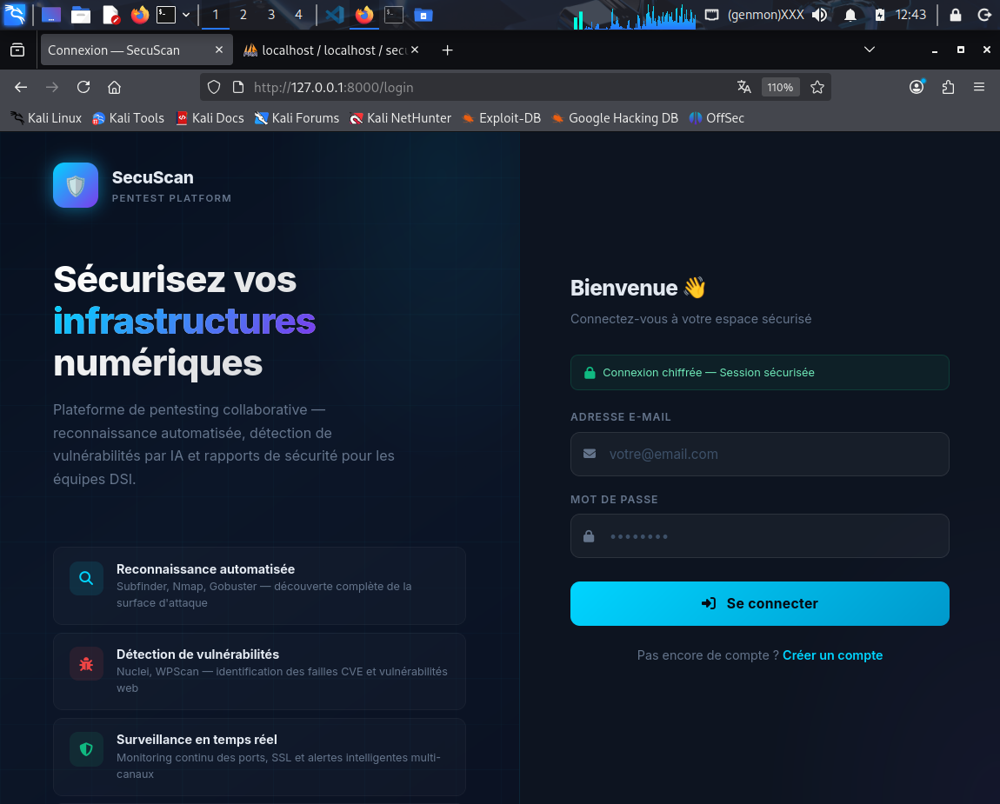

### 🧩 Tableau de bord principal
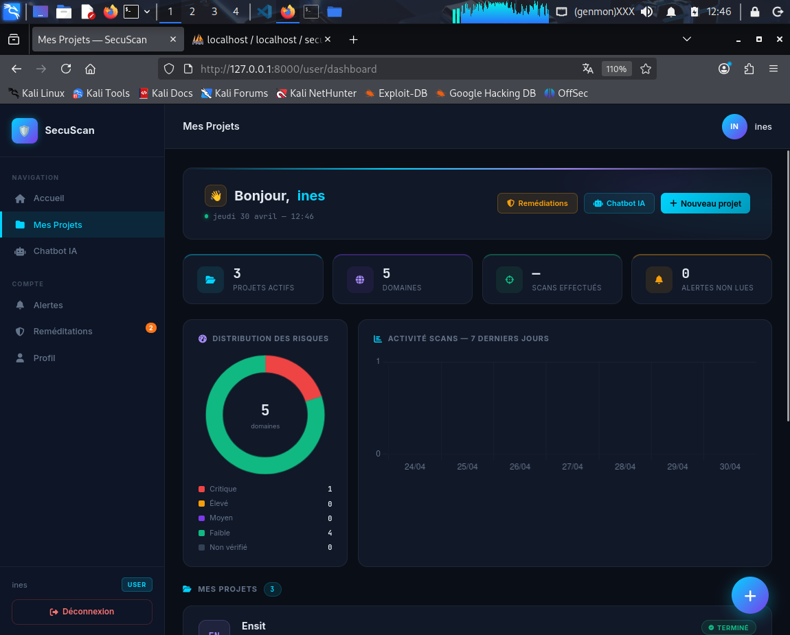

### 🧠 Tableau de bord administrateur
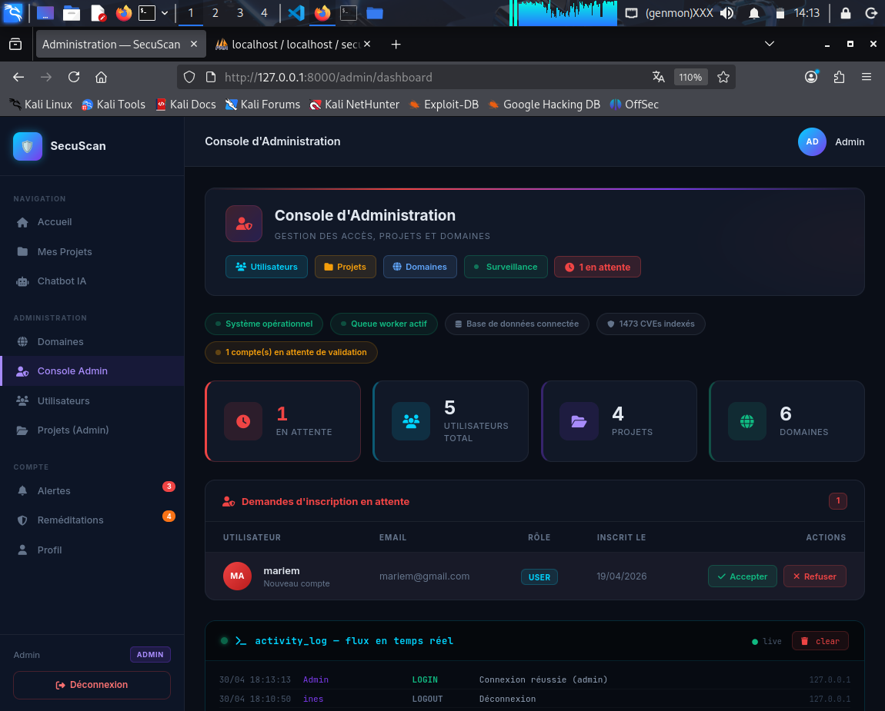

### 📊 Résultats de scan
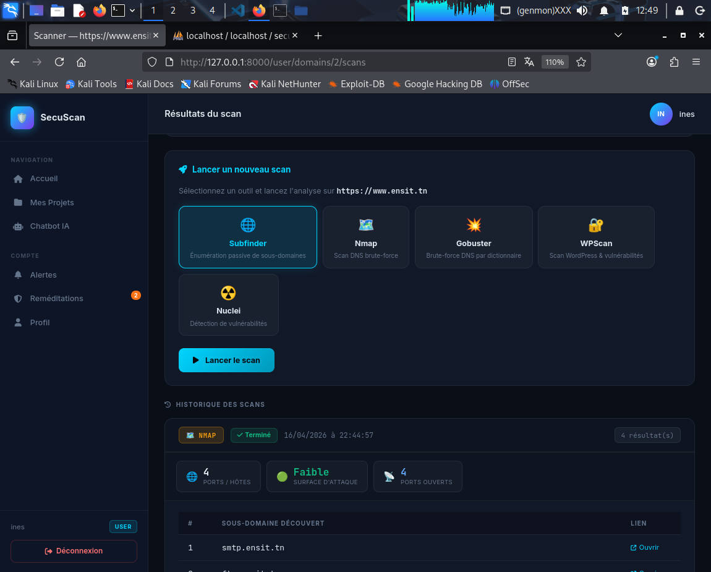

### ⚙️ Page de configuration des alertes
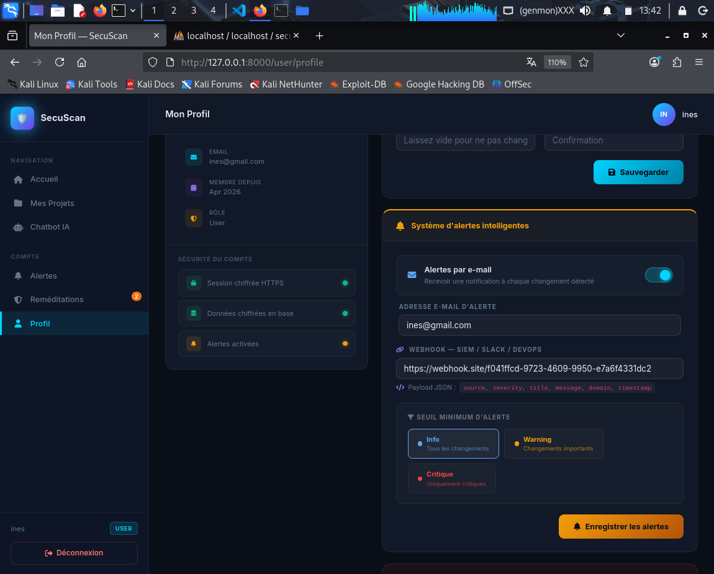

### 🚨 Page d’alertes
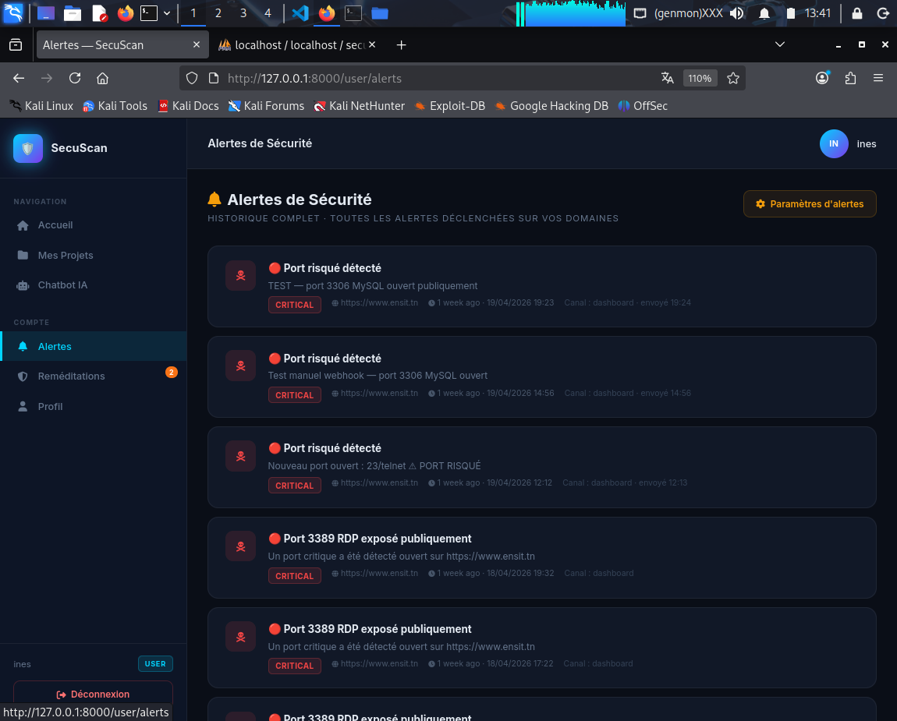

### 🧍‍♀️ Inscription utilisateur
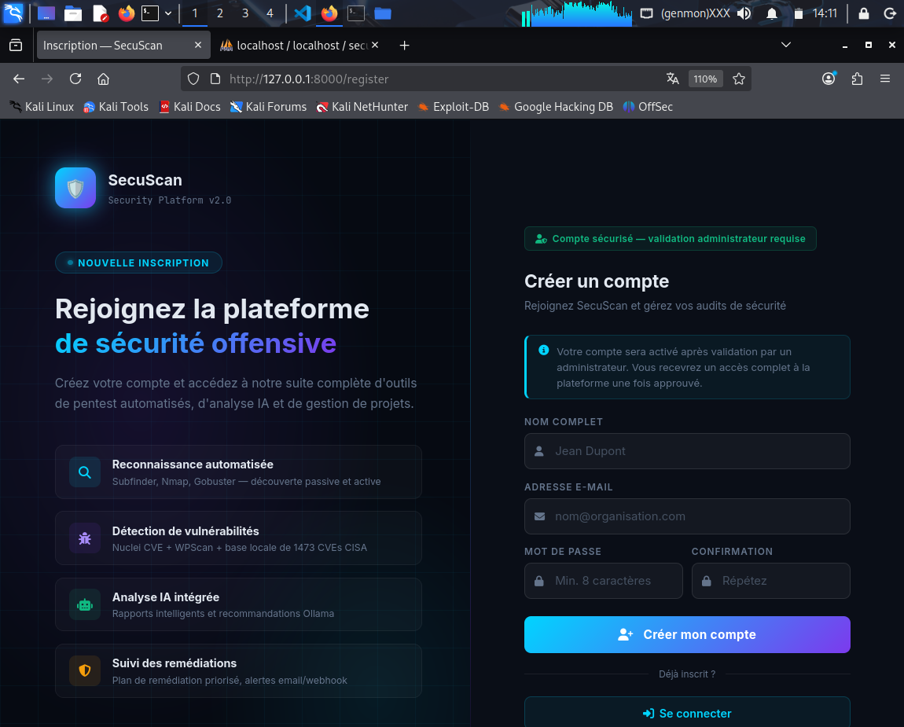

### 💬 Module de chat
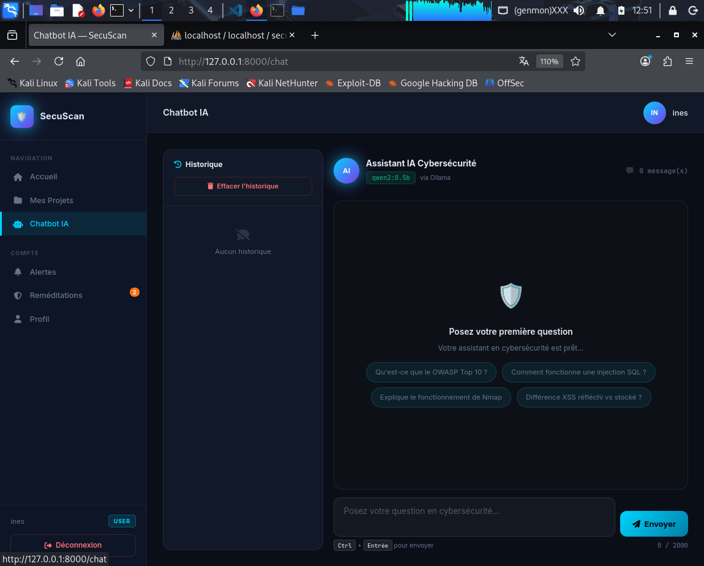

### 🔎 Monitoring en temps réel
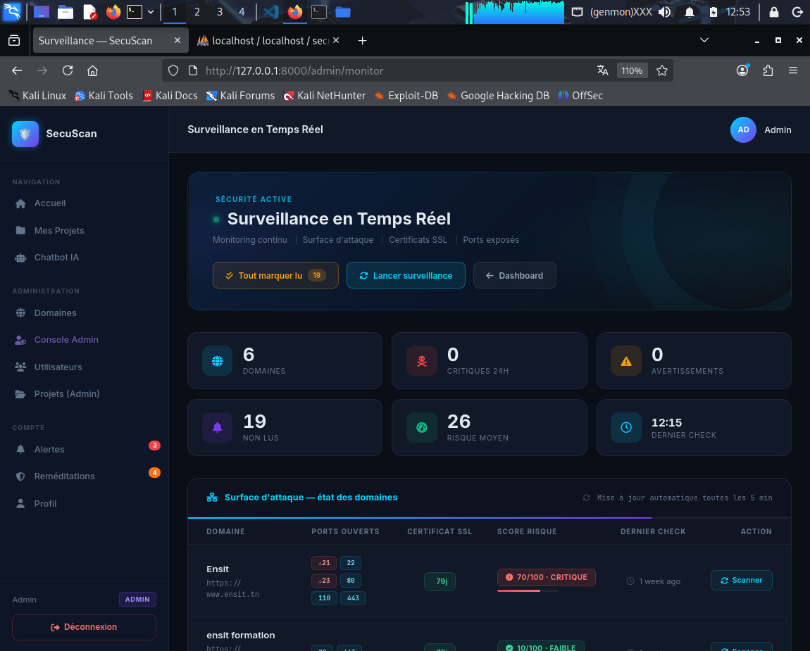

### 🛠 Remédiation et gestion des risques
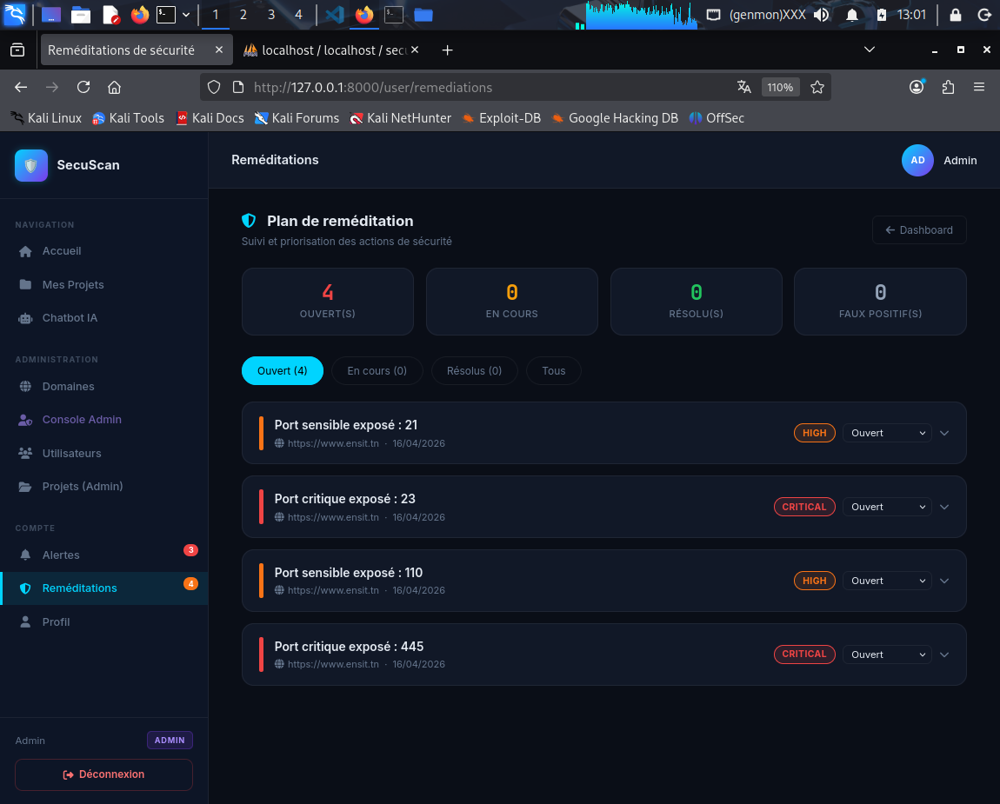

### 📉 Panneau d’analyse des risques
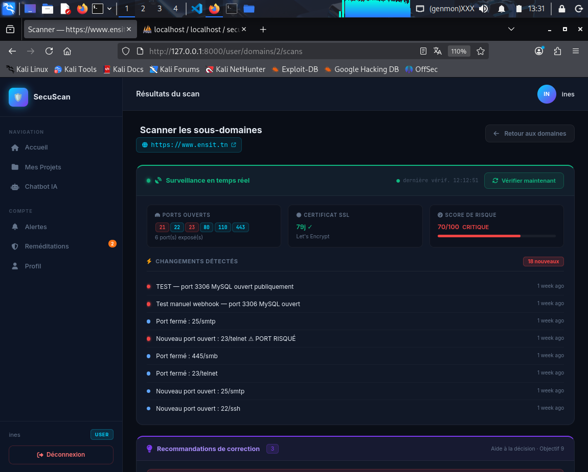

---
## 👩‍💻 Auteur
Projet réalisé par **Ines Hajjem**  
